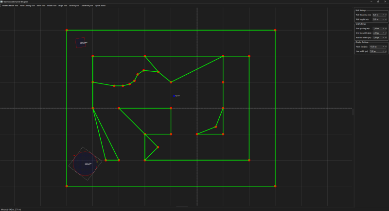
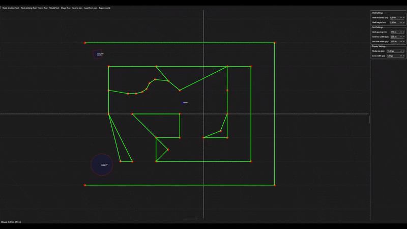
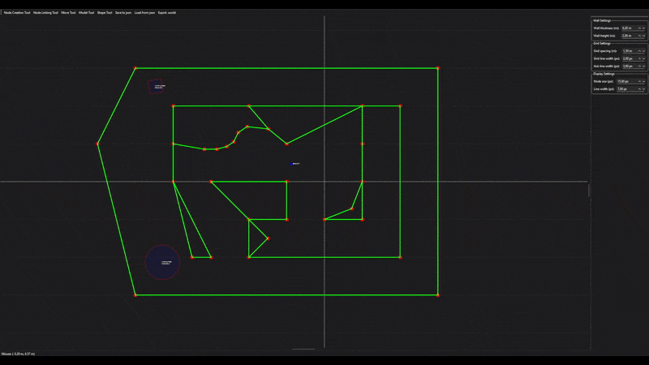
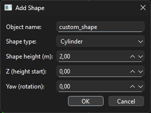
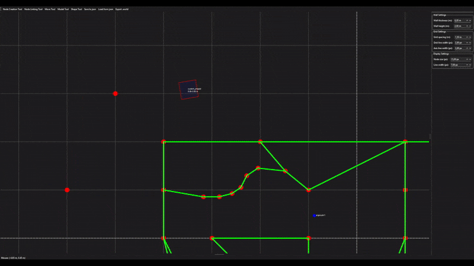
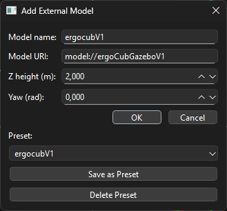

# Gazebo Walled World Designer

A graphical application for designing simulation environments for **Gazebo Classic**, built using **PyQt6**.



---

## 🔧 Features Overview

| Feature             | Description                                                   |
|---------------------|---------------------------------------------------------------|
| Node Creation       | Place nodes freely on the canvas                              |
| Grid snapping       | Place nodes precisely using configurable grid                 |
| Wall Drawing        | Connect nodes to create walls                                 |
| Shape Drawing       | Insert geometric shapes like squares and cylinders            |
| External Models     | Import models using a URI (e.g., `model://sun`)               |
| JSON Import/Export  | Save/load full scene including positions, shapes and models   |
| SDF Export          | Export to `.world` format for use in Gazebo Classic           |

---

## 🖥️ Getting Started

### 1. Clone and Run
Clone repository
```bash
git clone https://github.com/YourName/GazeboWalledWorldDesigner.git
```
Enter directory
```bash
cd GazeboWalledWorldDesigner
```
Install PyQt6
```bash
pip install PyQt6
```
Launch the app
```bash
python main.py
```

---

### ✅ 4. Nodes & Walls


## 🧱 Nodes & Walls

### ➕ Add Node
- Select the *Node Tool*
- Use G-key to toggle grid snapping (on by default)
- Left-click anywhere in the canvas

### 🔗 Connect Nodes (Wall)
- Select the *Wall Tool*
- Click two nodes in sequence



### 🗑️ Remove Node or Wall
- Right-click the wall or node using the appropriate tool



## 🌀 Shape Tool (Square / Cylinder)

### ➕ Add Shape
- Select the *Shape Tool*
- Click to open the dialog
- Options:
  - Select type: `Square` or `Cylinder`
  - **Name** (must be unique; duplicate names may prevent spawning in Gazebo)
  - Shape height (height of the object top) and Z height start (height of the objects bottom) (Shape-height - Z-height-start = height of the shape)
  - Rotation (Yaw) in radians
  - Height and Size in metres

 
  
- Objects can be rotated and resized by dragging colored tabs after selecting shape using the move tool:
    -  red circle for rotation
    -  yellow square to resize
    -  


## 🧊 External Models

### ➕ Add External Model
- Select *Model Tool*
- Click to open dialog
- Options:
  - **Name** (must be unique; duplicate names may prevent spawning in Gazebo)
  - URI (e.g., `model://sun`)
  - Pose (X, Y, Z, Yaw)



## 💾 Save & Load

### 🟢 Save Scene to JSON
- `Save to JSON` button
- Saves the project into a `.json` file that can be loaded by the app

### 🔁 Load Scene
- `Load from JSON`

### 📤 Export to `.world`
- Click `Export World` button
- Generates an SDF `.world` file with all shapes and models

